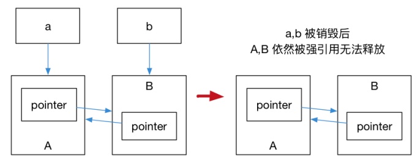

# C++11

## 可变参数模板


## 智能指针

**显示内存管理的问题：**

- 野指针：一些内存单元已释放，指向它的指针却还在被使用。这些内存可能被运行时系统重新分配给程序使用，从而导致无法预测的错误。
- 重复释放：释放已经被释放过的内存，或者释放已经被重新分配过的内存，就会导致重复释放错误。
- 内存泄漏：不再需要使用的内存如果没有被释放就会导致内存泄漏。如果程序不断地重复进行这类操作，将会导致内存占用剧增。

**引用计数：**
为了防止内存泄露而产生的。对于动态分配的对象，进行引用计数，每增加一次对同一个对象的引用，引用对象的引用计数就会加一，每删除一次引用，引用计数就会减一，当减为零时，就自动释放指向的堆内存。 

**RAII：**
对于一个对象，在构造函数的时候申请空间，而在析构函数（在离开作用域时调用）释放空间，也就是 RAII 资源获取即初始化技术。 

### unique_ptr

`unique_ptr` 是一种独占的智能指针，不能与其他指针指向同一个对象。可以用 `std::move` 转移给其他的 `unique_ptr`。

`unique_ptr` 是一个删除了拷贝构造函数，保留了移动构造函数的指针封装类型。

```c++
std::unique_ptr<int> up1(std::make_unique<int>(10));
std::unique_ptr<int> up2(std::move(p1));
```

### shared_ptr

`shared_ptr` 允许多个智能指针指向一个对象，并通过**引用计数**记录多少个 `shared_ptr` 指向该对象，当引用计数为零的时候就会自动释放对象，从而避免显示调用 `delete`。

```c++
auto pointer1 = std::make_shared<int>(10);
auto pointer2 = pointer; // 引用计数 +1
int *p = pointer.get(); // 这样不会增加引用计数

std::cout << "pointer1.use_count() = " << pointer1.use_count() << std::endl; // 2
std::cout << "pointer2.use_count() = " << pointer2.use_count() << std::endl; // 2

pointer2.reset();
std::cout << "pointer1.use_count() = " << pointer1.use_count() << std::endl; // 1
std::cout << "pointer2.use_count() = " << pointer2.use_count() << std::endl; // 0, pointer2 已 reset
```

### weak_ptr

**循环引用：**

```c++
struct A;
struct B;
struct A {
	std::shared_ptr<B> pointer;
    ~A() {
    	std::cout << "A 被销毁" << std::endl;
    }
};
struct B {
	std::shared_ptr<A> pointer;
    ~B() {
    	std::cout << "B 被销毁" << std::endl;
    }
};
int main() {
    auto a = std::make_shared<A>();
    auto b = std::make_shared<B>();
    a->pointer = b;
    b->pointer = a;
}
```

运行结果是 a,b 的内存都不会被销毁，因为 a,b 内部的 pointer 互相引用，使得 a,b 的引用计数都变为了 2，离开作用域时， a,b 被析构，却只能让引用计数减一，a,b 指向的内存区域引用计数不为零，而外部已经没有办法找到这块内存了，就造成了**内存泄露**。



> 在析构函数中显示的 reset() share_ptr 成员变量可以让引用计数减小到0，但这就和手动 delete 一样了。

`weak_ptr` 是一种弱引用，可以指向 `shared_ptr` 指向的内存，而不会增加引用计数。

`std::weak_ptr` 没有 `*` 运算符和 `->` 运算符，所以不能够对资源进行操作，其 `expired()` 方法能在资源未被释放时，会返回 false，否则返回 true，检查 `shared_ptr` 是否存在。`lock()` 方法返回其指向内存的一个 `shared_ptr` 对象，在所指对象内存已经无效时，返回指针空值 `nullptr`。

## lambda

lambda 是一个闭名的 function object，作用是一个 (inline) function。

### 匿名函数语法
```[capture] (parameters) mutable ->return-type{statement} ```

- `[capture]`：捕捉列表。`[]` 表示 lambda 函数，捕捉列表能捕捉上下文中的变量供 lambda 函数使用。在块作用域以外的lambda捕捉列表必须为空。
- `(parameeters)`：参数列表。如果没有参数，可以省略`()`。
- `mutable`：默认 lambda 函数是 const 函数，mutable 可以取消常量性。使用时，参数列表不能省略。
- `->return-type`：返回类型。没有返回值时可以省略，或返回类型明确时，编译器对返回类型进行推导。
- `{statement}`：函数体。除了可以使用参数，还能使用捕获的变量。

> 可以忽略`参数列表`和`返回类型`，但不可以忽略```捕获列表```和```函数体```

**lambda 函数与普通函数的最大区别**之一，就是 lambda 可以通过捕捉列表访问一些上下文中的数据。

|语法 |描述|
|-|-|
|[var]|表示值传递方式捕捉变量var。在 lambda 函数中是不可更改的常量。|
|[=]|表示值传递方式捕捉所有父作用域的变量，包括this。pass by value|
|[&var]|表示引用传递捕捉变量var。|
|[&]| 表示引用传递捕捉所有父作用域的变量，包括this。pass by reference |
|[this]|表示值传递方式捕捉当前的this指针。|

### lambda和仿函数

仿函数是编译器实现 lambda 的一种方式，通常编译器都会把 lambda 函数转化为成为一个仿函数对象。

```c++
int id = 0;
auto f = [id]() mutable {
	std::cout << "id:" << id << std::endl;
	++id;
}

id = 42;
f();
f();
f();
std::cout << id << std::endl;   // 0 1 2 42
```

```c++
class Functor {
private:
    int id;
public:
	void operator()(){  // operator()被重载
        std::cout << "id:" << id << std::endl;
		++id;
    }  
};
Functor f;
```

**lambda 和仿函数**都可以捕捉一些变量作为初始状态并接受参数进行运算。lambda 函数捕捉了作用域数据，而仿函数则以作用域数据初始化类。lambda 捕捉的变量都会成为等价仿函数的成员变量，而常量成员函数(如operator())中改变其值是不允许的。

使用 lambda 代替仿函数的应该满足如下一些条件:

- 局限于一个局部作用城中使用的代码逻辑。
- 这些代码逻辑需要被作为参数传递。

lambda 函数并非函数指针，C++11 允许 lambda 表达式向函数指针的转换，前提是 lambda 函数没有捕捉任何变量，且函数指针所指的函数原型，必须跟 lambda 函数有着相同的调用方式。

## inline

如果函数在```class body```内定义，自动成为```inline候选```，如果在 class 本体外定义就不是 inline。
inline 只是对编译器的建议，由编译器决定，如果函数太复杂，编译器就没有能力把函数变成 inline。

```cpp     
inline double  //如果在body外定义,可以在前面加上inline 
imag(const complex& x)
{
    return x.imag ();
}
```

## std::function和bind

## 委托构造和继承构造


## 移动语义

## 内存对齐alignof/alignas

`alignof` 用来获取平台的内存对齐大小，返回值 `std::size_t` 类型。

`alignas` 指定内存对齐大小，只要是一个编译期数值（#define, static const, template）都支持alignas，alignas只能改大不能改小。

```c++
struct Storage {
    char a;
    int b;
    double c;
    long long d;
};
struct alignas(std::max_align_t) AlignasStorage {
    char a;
    int b;
    double c;
    long long d;
};
int main() {
    std::cout << alignof(Storage) << std::endl;
    std::cout << alignof(AlignasStorage) << std::endl;
    return 0;
}
```

`std::max_align_t` 用来返回当前平台的最大默认内存对齐大小。 

# C++14


# C++17

fold expression
