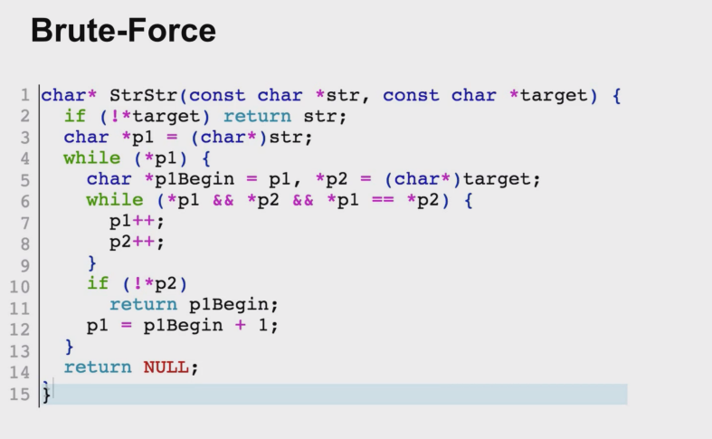

# 0

## 0.1 C语言的陷阱

- 内存重叠
- 临时变量太多或者没安全释放
- 没有测试内存越界
- 指针操作不熟悉

```c
void *memmove(void *dest, const void *src, size_t n)
{
    char *p1 = dest;
    conse char *p2 = src;
    if (p1 < p2) {  // dest在src前面
        while (n--) {
            *p1++ = *p2++;
        }
    } else {  // dest在src后面，内存可能重叠，因此从后往前拷贝
        p1 += n;
        p2 += n;
        while (n--) {
            *--p1 = *--p2;
        }
    }
    return dest;
}
```

## 0.2 编程基本功

**面试考察的编程基本功：**

- 程序风格
- 编码习惯：异常检查，边界处理
- 沟通
- 测试：主动写出合理的test case

**代码风格：**

代码块分为三大块：异常处理（空串和边界处理），主题，返回

- 变量名有意义
- 缩进
- 空格：运算符两边
- 代码可读性：if只有一句也加花括号
- int* p而不是int *p

# 1. 数组和字符串

## 1.1 字符串匹配

- brute-force

```c
int StrStr(char *haystack, char *needle) {
}
```


- KMP

计算目标字符串的哈希，遍历源字符串，求相同长度的字符串的哈希，对比成功后遍历比较目标字符串。
