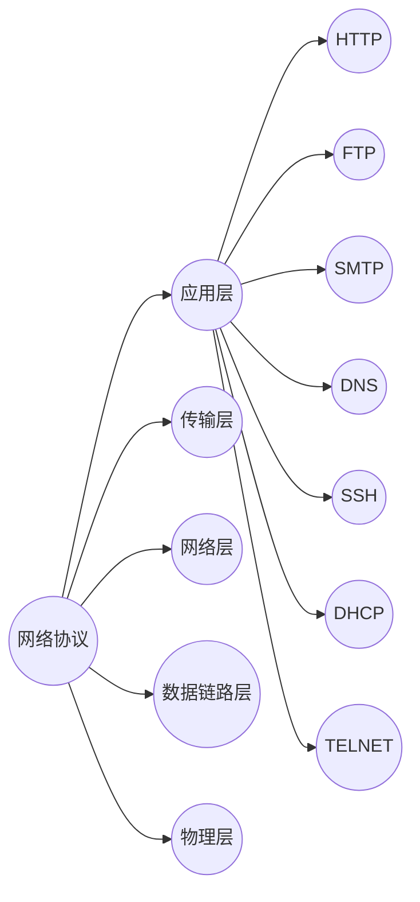

# 1.OSI七层模型及功能

<table>
    <tr>
        <td>  OSI  </td> 
        <td>  TCP/IP  </td> 
        <td>  数据包  </td> 
        <td>  功能  </td> 
   </tr>
    <tr>
        <td>  ⑦应用层  </td>    
  		  <td>  ④应用层 </td> 
        <td>   报文 </td> 
        <td>  解决通过应用进程之间的交互来实现特定网络应用的问题 </td> 
    </tr>
    <tr>
        <td>  ⑥表示层</td> 
        <td rowspan="2">   </td> 
        <td rowspan="2">   </td> 
        <td>解决通信双方交换信息的表示问题</td>    
    </tr>
    <tr>
        <td> ⑤会话层</td> 
        <td>解决进程之间进行会话问题</td>    
    </tr>
    <tr>
        <td> ④运输层</td> 
        <td > ③运输层 </td> 
        <td > TCP报文段  </td> 
        <td>解决进程之间基于网络的通信问题</td>    
    </tr>
    <tr>
        <td>③网络层</td> 
        <td > ②网际层 </td> 
        <td > IP数据报  </td> 
        <td>解决分组在多个网络之间传输（路由）的问题</td>    
    </tr>
    <tr>
        <td>②数据链路层</td> 
        <td rowspan="2"> ①网络接口层 </td> 
        <td > 帧  </td> 
        <td>解决分组在一个网络（或一段链路）上传输的问题</td>    
    </tr>
    <tr>
        <td>①物理层</td> 
        <td > 比特流  </td> 
        <td>解决使用何种信号来传输比特0和1的问题</td>    
    </tr>
</table>
		
- 网络七层模型是一个标准，而非实现。
- 网络四层模型是一个实现的应用模型。
- 网络四层模型由七层模型简化合并而来。

			
